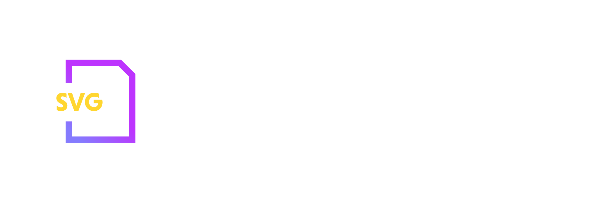

<br /><br />
<p align="center">

</p>
<br /><br />

# vite-svg-react-loader

Vite plugin to import SVG files directly as ReactComponent

<br />

## Installation

#### npm

```shell
$ npm i --save-dev @andylacko/vite-svg-react-loader
```

#### yarn

```shell
$ yarn add -D @andylacko/vite-svg-react-loader
```

<br />

## Usage

Add `svgLoader()` (or whatever you decide to name your default import) to the list of plugins in the ViteJS configuration file (`vite.config.js`) of your project.

```js
import svgLoader from '@andylacko/vite-svg-react-loader'

export default defineConfig({
    //...
    plugins: [svgLoader()]
});
```

Once you have done that, you can import any of your SVG asset as a React component:

```js
// The default behavior of ViteJS will get you the URL of the asset
import SVGAsset from 'assets/yourMama.svg'

// That you can use normally
function SomeComponent() {
    return (
        <button>
            <SVGAsset /> Click Me!
        </button>
    );
}
```

<br />

## Typescript

If you are using this plugin in a Typescript project, adding the type definitions to your `tsconfig.json` will assign correct types to the imported SVG assets:

```json
{
    "compilerOptions": {
        "types": [ "@andylacko/vite-svg-react-loader/svgType" ]
    }
}
```

<br />

## Configuration

<br />

### `query`

If you want to import only some components as React components, and import other ones as standard string resource path, you can use the `query` option:

```js
export default defineConfig({
    //...
    query: 'as-react-component'
});
```

In your jsx/tsx file:

```jsx
import MyReactSvg from './my_svg.svg?as-react-component'
import MySvg from './my_svg'
…

<MyReactSvg /> // This one is treated as a react component
 // This one is imported as a resource path
```

### `keepEmittedAssets`

By default, the plugin will prevent transformed SVG assets to be emitted when building the production bundle (when using Vite 2.5.0 or later). If you want or need to have those files emitted anyway, pass the `{keepEmittedAssets: true}` option:

```js
export default defineConfig({
    //...
    plugins: [svgr({ keepEmittedAssets: true })]
});
```

<br />

### `svgrOptions`

Allows to pass global svgr configuration flags. See svgr [configuration documentation](https://react-svgr.com/docs/options/) for more details.

```ts
export default defineConfig({
    //...
    plugins: [
        svgr({
            svgrOptions: {
                icon: true,
                dimensions: false
                // etc...
            }
        })
    ]
});

// for quick overview
interface SVGROptions {
  icon?: boolean
  dimensions?: boolean
  expandProps?: 'start' | 'end' | false
  svgo?: boolean
  ref?: boolean
  memo?: boolean
  replaceAttrValues?: Record<string, string>
  svgProps?: Record<string, string>
  titleProp?: boolean
}
```

<br />

## Acknowledgement

This plugin started as a fork of `@honkhonk/vite-plugin-svgr`, but it can import svg into react component directly.

<br />

## License

MIT
